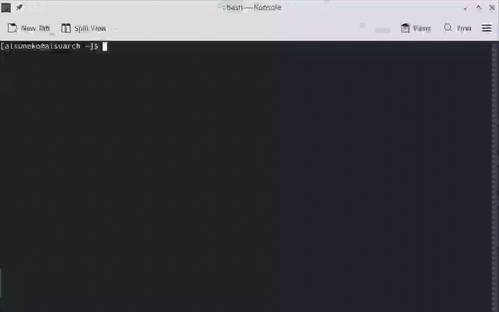

# aisuclean
Simple, stupid and portable folder cleaner.
Could either be used directly or be integrated into automation (cron, CI pipeline...) for a better system maintenance experience.

See it in action:



## Features
> or "Why not just write a dead simple shell script and get away with it?"
- distro-agnostic, works out of the box
- pure Rust, just faster than shell script... at least in some cases
- compact binary (<= 1MB), allowing it to be easily integrated into a varity of workflows
- keeps the target folders themselves but not their content, to better prevent unexpected filesystem behavior
- (shrug) or perhaps I'm just a bit strange :(

## Installation
Simply download the prebuilt binary from [Releases](https://github.com/aisuneko/aisuclean/releases/) and use it however you like: run it directly, daemonize it or add it to cron... The choice is yours.

Currently only binaries for **Linux x86_64 / aarch64** are available, as the tool is primarily designed for Linux distros; tell me if it works on Windows or macOS or more, or if it contains silly bugs...

## Usage
Typically `aisuclean` uses a simple config file to store the folders that needs to be cleaned. This allows adaptive, flexible cleaning setups in workflows. The file should contain the path to each *directory*, one per line, for example:
```
/path/to/a/directory
/path/to/another/directory
/another/dir/
```
With this config file, either use `-s/--scan` to only scan the folders and calculate their size, or use `-n/--nuke` to nuke the *contents in the folder* (the folder itself will not be removed), or combine them both, like:
```
aisuclean -s -n -c /path/to/config
```
Just doing a test run and doesn't feel like creating a config file? Use `-p/--path` to manually designate paths to process:
```
aisuclean -s -n -p folder_1 folder_2 folder_n
```
Tired of progress bars, or seeking a "headless" mode? use `-q/quiet` to suppress all output except stderr.

Full usage:
```
Usage: aisuclean [OPTIONS] <--scan|--nuke> <--config <CONFIG>|--path <PATHS>...>

Options:
  -s, --scan             Scans folders in config and calculate their size
  -n, --nuke             Nuke all items under all folders in config
  -c, --config <CONFIG>  Path to config file. Either this or --path must be present
  -p, --path <PATHS>...  Manually specify folders to process. Either this or --config must be present
  -q, --quiet            Suppresses all output except stderr
  -h, --help             Print help
  -V, --version          Print version
```

## License
MIT
